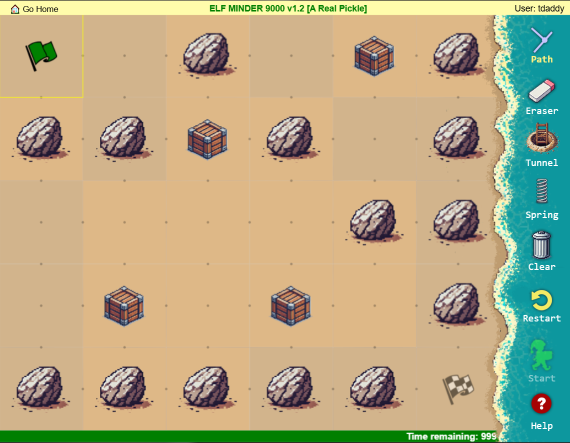
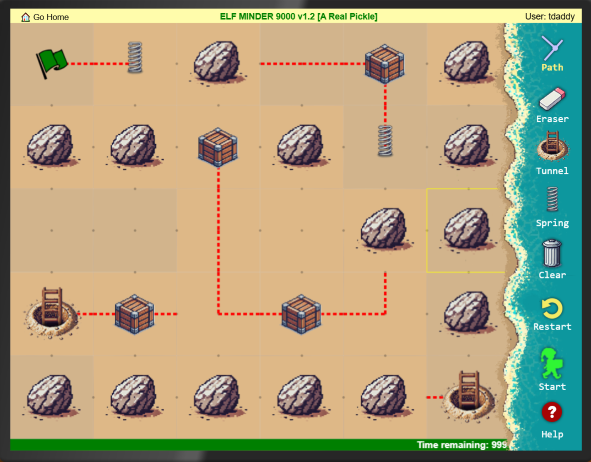

# Prologue

[Back to main](../README.md)

The prologue was the first set of introductory challenges released. They are a relatively easy and fun introduction into this year's challenges.
## Challenge 1: First Terminal

The first terminal challenge is meant to teach the user how to use the terminals throughout the game. It only includes a Silver challenge.
### Silver

When the challenge is first opened, I was presented with a prompt:


Following the instructions, I typed `answer` and pressed the Enter key to solve the challenge.


Job done!
## Challenge 2: Elf Connect

This challenge is a holiday- and cybersecurity-themed version of the game Connections. To play, you are presented with 16 words and must select related words in groups of four to collect points.

It has both a Silver and Gold Challenge.


### Silver

This challenge is simply to complete the game. You can complete it the easy way, by finding the correct answers, or you can cheat (like me). Reviewing the source code, I found the following code:

```javascript
        const wordSets = {
            1: ["Tinsel", "Sleigh", "Belafonte", "Bag", "Comet", "Garland", "Jingle Bells", "Mittens", "Vixen", "Gifts", "Star", "Crosby", "White Christmas", "Prancer", "Lights", "Blitzen"],
            2: ["Nmap", "burp", "Frida", "OWASP Zap", "Metasploit", "netcat", "Cycript", "Nikto", "Cobalt Strike", "wfuzz", "Wireshark", "AppMon", "apktool", "HAVOC", "Nessus", "Empire"],
            3: ["AES", "WEP", "Symmetric", "WPA2", "Caesar", "RSA", "Asymmetric", "TKIP", "One-time Pad", "LEAP", "Blowfish", "hash", "hybrid", "Ottendorf", "3DES", "Scytale"],
            4: ["IGMP", "TLS", "Ethernet", "SSL", "HTTP", "IPX", "PPP", "IPSec", "FTP", "SSH", "IP", "IEEE 802.11", "ARP", "SMTP", "ICMP", "DNS"]
        };

        let wordBoxes = [];
        let selectedBoxes = [];
        let correctSets = [
            [0, 5, 10, 14], // Set 1
            [1, 3, 7, 9],   // Set 2
            [2, 6, 11, 12], // Set 3
            [4, 8, 13, 15]  // Set 4
        ];
```

This code shows the arrays `wordSets` for each level and also reveals the `correctSets` array that contains arrays if `int` that show how the correct answers in each element of `wordSets` are grouped.

Using that information, I wrote a quick python script to output the correct groups of words:

```python
#! /usr/bin/env python

import numpy

wordSets = {
            1: ["Tinsel", "Sleigh", "Belafonte", "Bag", "Comet", "Garland", "Jingle Bells", "Mittens", "Vixen", "Gifts", "Star", "Crosby", "White Christmas", "Prancer", "Lights", "Blitzen"],
            2: ["Nmap", "burp", "Frida", "OWASP Zap", "Metasploit", "netcat", "Cycript", "Nikto", "Cobalt Strike", "wfuzz", "Wireshark", "AppMon", "apktool", "HAVOC", "Nessus", "Empire"],
            3: ["AES", "WEP", "Symmetric", "WPA2", "Caesar", "RSA", "Asymmetric", "TKIP", "One-time Pad", "LEAP", "Blowfish", "hash", "hybrid", "Ottendorf", "3DES", "Scytale"],
            4: ["IGMP", "TLS", "Ethernet", "SSL", "HTTP", "IPX", "PPP", "IPSec", "FTP", "SSH", "IP", "IEEE 802.11", "ARP", "SMTP", "ICMP", "DNS"]
        }
        
correctSets = [
            [0, 5, 10, 14], # Set 1
            [1, 3, 7, 9],   # Set 2
            [2, 6, 11, 12], # Set 3
            [4, 8, 13, 15]  # Set 4
        ];
        
for round, set in wordSets.items():
    print("Set {}".format(round))
    print("=" * 80)
    for i in correctSets:
        print(numpy.array(set)[i])
    print("=" * 80)
```

Output:

```bash
Set 1
================================================================================
['Tinsel' 'Garland' 'Star' 'Lights']
['Sleigh' 'Bag' 'Mittens' 'Gifts']
['Belafonte' 'Jingle Bells' 'Crosby' 'White Christmas']
['Comet' 'Vixen' 'Prancer' 'Blitzen']
================================================================================
Set 2
================================================================================
['Nmap' 'netcat' 'Wireshark' 'Nessus']
['burp' 'OWASP Zap' 'Nikto' 'wfuzz']
['Frida' 'Cycript' 'AppMon' 'apktool']
['Metasploit' 'Cobalt Strike' 'HAVOC' 'Empire']
================================================================================
Set 3
================================================================================
['AES' 'RSA' 'Blowfish' '3DES']
['WEP' 'WPA2' 'TKIP' 'LEAP']
['Symmetric' 'Asymmetric' 'hash' 'hybrid']
['Caesar' 'One-time Pad' 'Ottendorf' 'Scytale']
================================================================================
Set 4
================================================================================
['IGMP' 'IPX' 'IP' 'ICMP']
['TLS' 'SSL' 'IPSec' 'SSH']
['Ethernet' 'PPP' 'IEEE 802.11' 'ARP']
['HTTP' 'FTP' 'SMTP' 'DNS']
================================================================================
```

I used these to solve the game and was awarded Silver.
### Gold

I was now looking to beat the high score. A quick scan of the game's source reveals a variable named `score`, shown below:

```javascript
let score = parseInt(sessionStorage.getItem('score') || '0'); // Initialize score
```

Assuming that this holds the score, I used the Console in your browser's Developer Tools to modify the score value:

```javascript
> score = 51000
< 51000
```

Completing a new set of answers nabbed the Gold.


Woo!
## Challenge 3: Elf Minder

Elf Minder is a maze-style game where you must guide an elf through a maze using various tools including a Path tool (to direct motion), a spring tool (to jump over squares), and a portal tool (to warp between endpoints). The object of the game is to guide the elf from a Green Flag to a Checkered Flag while collecting Crates along the way, all within a limited amount of time. While the elf traverses your Path, you may  rotate  Segments to help guide along their way.


### Silver

The Silver challenge is relatively uneventful - complete all the levels and you receive Silver. I'll leave solutions up to the reader, but proof of completion is shown below:


Wow!
### Gold

After completing Silver, a secret level titled "A Real Pickle" is revealed. The name is apt, as the map appears roughly unsolvable by default:



However, there are at least two ways to solve it.
#### Illegally Placed Portal

When placing entities around the map, like springs and portals, the game forbids you from placing them on top of most objects. Usually, the server will throw various Captain Planet themed errors if you violate these rules. You can, however, place them on top of flags through the magic of computing. You can do this through various means, including modifying the browser's `localStorage` representation of the maps, but those are boring to watch so we'll use a more visual method for the purpose of storytelling.

Examining the game's source code, you may notice the following bit within `game2.js`:

```javascript
const urlParams = __PARSE_URL_VARS__();
const levelNum = urlParams.level ? urlDecode(urlParams.level) : '';
const rid = urlParams.id;
const isEditor = !!urlParams.edit;

if (isEditor) {
    adminControls.classList.remove('hidden');
    console.log('⚡⚡⚡⚡⚡⚡⚡⚡⚡⚡⚡⚡⚡⚡⚡');
    console.log('⚡ Hey, I noticed you are in edit mode! Awesome!');
    console.log('⚡ Use the tools to create your own level.');
    console.log('⚡ Level data is saved to a variable called `game.entities`.');
    console.log('⚡ I\'d love to check out your level--');
    console.log('⚡ Email `JSON.stringify(game.entities)` to evan@counterhack.com');
    console.log('⚡⚡⚡⚡⚡⚡⚡⚡⚡⚡⚡⚡⚡⚡⚡');
}
```

This code implies the presence of a map editor when accessing the game with a specific URL parameter, shown below:

`https://hhc24-elfminder.holidayhackchallenge.com/index.html?id=[REDACTED]&level=A%20Real%20Pickle&edit=true`

As expected, this triggered a level editor:


This editor allowed me to erase entities that would not normally be erasable, such as Blockers and the flags. So I erased the flag and placed a portal with a path to it in its place:


These edits were saved in the browser's `localStorage`. After disabling the editor and refreshing the page, the map reloaded with my entities in place *and* the flag back where the server expects it to be; this is not rendered.

I built a complete path using the tunnel and completed the game:



Neat!
#### Diagonal Jump 

More realistically, this is an arbitrary jump, but we'll go with the name Discord has arrived on.

Examining the source code, I located the following function within `guide.js` with a comment that indicates something is broken:

```javascript
getSpringTarget(springCell) {
        const journey = this.hero.journey;
        const dy = journey[1][1] - journey[0][1];
        const dx = journey[1][0] - journey[0][0];

        let nextPoint = [ springCell[0], springCell[1] ];
        let entityHere;
        let searchLimit = 15;
        let searchIndex = 0;
        let validTarget;

        do {
            searchIndex += 1;
            nextPoint = [ nextPoint[0] + dx, nextPoint[1] + dy ];
            
            entityHere = this.entities.find(entity => 
                ~[
                    EntityTypes.PORTAL,
                    EntityTypes.SPRING,
                ].indexOf(entity[2]) &&
                searchIndex &&
                entity[0] === nextPoint[0] &&
                entity[1] === nextPoint[1]);
            
            if (searchIndex >= searchLimit) {
                break;
            }

            validTarget = this.isPointInAnySegment(nextPoint) || entityHere;
        } while (!validTarget);

        if (this.isPointInAnySegment(nextPoint) || entityHere) {
            if (entityHere) return this.segments[0][0]; // fix this
            return nextPoint;
        } else {
            return;
        }        
    }

```

This function, predictably, calculates the cell the Elf lands on when using the Spring to jump. It first determines the cell where the Elf will land by selecting the next cell in the direction the Elf is moving. Notably, it determines of a square contains a Portal (`EntityTypes.PORTAL`) or a Spring (`EntityTypes.SPRING`) in the following snippet:

```javascript
entityHere = this.entities.find(entity => 
                ~[
                    EntityTypes.PORTAL,
                    EntityTypes.SPRING,
                ].indexOf(entity[2]) &&
                searchIndex &&
                entity[0] === nextPoint[0] &&
                entity[1] === nextPoint[1]);
```

In the event the Elf lands on a cell which contains one of those Entities, it attempts to jump back to the begging of the Elf's path:

```javascript
if (this.isPointInAnySegment(nextPoint) || entityHere) {
            if (entityHere) return this.segments[0][0]; // fix this
            return nextPoint;
        } else {
            return;
        }   
```

However, `this.segments[0][0]` does not *actually* point to the beginning of the Elf's path, but to the first segment *placed* on the board. In this way, you can jump to any square that is not blocked with a rock (aka a Blocker in-game) by following the process below:

1. Place a segment on the square you wish to jump to
2. Build the paths for your gameplay as you normally would
3. When you are ready to jump, place a spring in the cell at the end of your path and either a spring or a portal on the cell directly next to it

This will cause `entityHere` to become `true` and then the jump destination will be set to `segments[0][0]`, the segment you placed in Step 1.

Using this, I constructed the following path to collect all of the crates and then jump to the finish using one path rotation (in-game known as a click):


On this path, the elf will start at the green flag, travel through the portal to the crates, use a spring to jump one of the Blockers to the final crate, and finally enter the cell with a blue square. Once it collides with the spring on the left of the blue square, the end square for the jump is calculated to be the square with a portal in it, highlighted in yellow. This sets `entityHere` to `true` and triggers the `segment[0][0]` jump, which is the segment placed at the checkered flag, triggering a Gold.

Hooray!
## Conclusion

The Prologue was a fun start to this year's Holiday Hack Challenge. On to [Act 1](../act1/README.md)!